# Bokeh-catplot

A utility to use Bokeh to generate plots where one of more variables is categorical. It generates box plots, jitter plots, histograms, and ECDFs.

## Motivation

[Bokeh](https://bokeh.pydata.org/) is a powerful Python-based plotting library. [HoloViews](https://holoviews.org/) is an excellent high-level plotting package that can use Bokeh to render plots. I suspect that most of the functionality in this module will eventually be incorporated into HoloViews. This module exists because HoloViews lacks some important functionality.

- It does not natively make ECDFs.
- Its definition of a box plot is non-canonical ([my fault](https://github.com/pyviz/holoviews/pull/1926), but will soon be [fixed](https://github.com/pyviz/holoviews/pull/3755)).
- It has a [bug when making horizontal strip plots](https://github.com/pyviz/holoviews/issues/3748).

There are all relatively minor fixes for HoloViews, which will likely have this functionality in the near future.

Nonetheless, ECDFs and horizontal strip plots are important visualizations, and this module provides a high-level way to render them using Bokeh.

## Installation

You can install bokeh-catplot using pip. You will need to have a recent version of Bokeh and all of its dependencies installed. 

    pip install bokeh_catplot

## Usage

Bokeh-catplot is imported as `bokeh_catplot`. While I'm at it, I'll import some sample data.


```python
import bokeh_catplot

from bokeh.sampledata import autompg
```


#### Sample data

To demonstrate usage, I will use the automobile fuel efficiency sample data set.


```python
df = autompg.autompg_clean

df.head()
```


<div>
<table border="1" class="dataframe">
  <thead>
    <tr style="text-align: right;">
      <th></th>
      <th>mpg</th>
      <th>cyl</th>
      <th>displ</th>
      <th>hp</th>
      <th>weight</th>
      <th>accel</th>
      <th>yr</th>
      <th>origin</th>
      <th>name</th>
      <th>mfr</th>
    </tr>
  </thead>
  <tbody>
    <tr>
      <th>0</th>
      <td>18.0</td>
      <td>8</td>
      <td>307.0</td>
      <td>130</td>
      <td>3504</td>
      <td>12.0</td>
      <td>70</td>
      <td>North America</td>
      <td>chevrolet chevelle malibu</td>
      <td>chevrolet</td>
    </tr>
    <tr>
      <th>1</th>
      <td>15.0</td>
      <td>8</td>
      <td>350.0</td>
      <td>165</td>
      <td>3693</td>
      <td>11.5</td>
      <td>70</td>
      <td>North America</td>
      <td>buick skylark 320</td>
      <td>buick</td>
    </tr>
    <tr>
      <th>2</th>
      <td>18.0</td>
      <td>8</td>
      <td>318.0</td>
      <td>150</td>
      <td>3436</td>
      <td>11.0</td>
      <td>70</td>
      <td>North America</td>
      <td>plymouth satellite</td>
      <td>plymouth</td>
    </tr>
    <tr>
      <th>3</th>
      <td>16.0</td>
      <td>8</td>
      <td>304.0</td>
      <td>150</td>
      <td>3433</td>
      <td>12.0</td>
      <td>70</td>
      <td>North America</td>
      <td>amc rebel sst</td>
      <td>amc</td>
    </tr>
    <tr>
      <th>4</th>
      <td>17.0</td>
      <td>8</td>
      <td>302.0</td>
      <td>140</td>
      <td>3449</td>
      <td>10.5</td>
      <td>70</td>
      <td>North America</td>
      <td>ford torino</td>
      <td>ford</td>
    </tr>
  </tbody>
</table>
</div>


Importantly, this data set is [tidy](https://en.wikipedia.org/wiki/Tidy_data); each row represents a single observation and each column a variable associated with an observation. Bokeh-catplot assumed that any inputted data frame is in tidy format. In the fuel efficiency example, the columns have different character. For example, `'mpg'` contains quantitative measurement of the miles per gallon of each car. The `'origin'` is **categorical** in the sense that it is not quantitative, but is a descriptor of the automobile that takes on a few discrete values. 

## Functionality

*Bokeh-catplot generates plots from tidy data frames where one or more columns contains categorical data and the column of interest in the plot is quantitative.*

There are four types of plots that Bokeh-catplot can generate.

- **Plots with a categorical axis**
    + Box plots: `bokeh_catplot.box()`
    + Strip plots: `bokeh_catplot.strip()`
    
    
    
- **Plots without a categorical axis**
    + Histograms: `bokeh_catplot.histogram()`
    + [ECDFs](https://en.wikipedia.org/wiki/Empirical_distribution_function): `bokeh_catplot.ecdf()`
    
The first three arguments of each of these functions are necessary to build the plot. They are:

- `data`: A tidy data frame
- `cats`: A list of columns in the data frame that are to be considered as categorical variables in the plot. If `None`, a single box, strip, histogram, or ECDF is plotted.
- `val`: The column of the data frame to be treated as the quantitative variable.

Here are the four default plots for `cats = 'origin'` and `val = 'mpg'`.


```python
p_box = bokeh_catplot.box(df, 'origin', 'mpg', title='box')
p_strip = bokeh_catplot.strip(df, 'origin', 'mpg', title='strip')
p_histogram = bokeh_catplot.histogram(df, 'origin', 'mpg', title='histogram')
p_ecdf = bokeh_catplot.ecdf(df, 'origin', 'mpg', title='ecdf')

bokeh.io.show(
    bokeh.layouts.column([p_box, p_strip, p_histogram, p_ecdf])
)
```

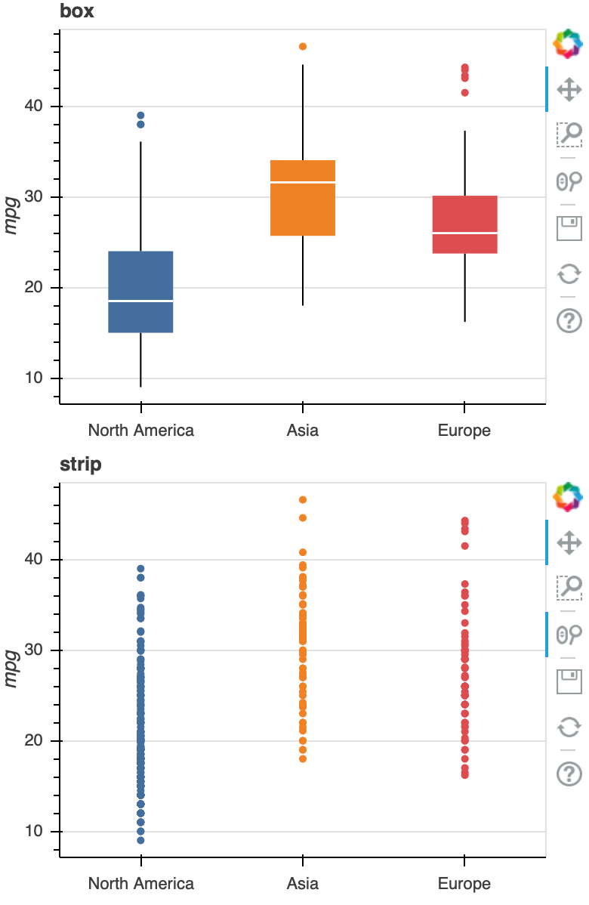

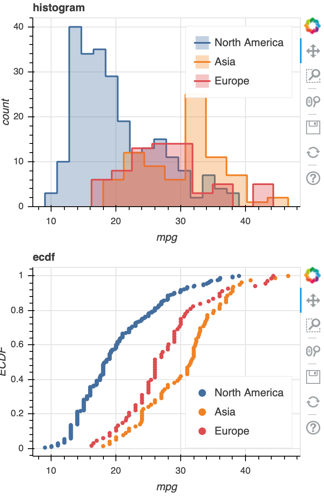


## Additional kwargs

Each of the four functions also has the following additional optional keyword arguments.

- `palette`: A list of hex colors to use for coloring the markers for each category. By default, it uses the default color scheme of [Vega-Lite](https://vega.github.io/vega-lite/).
- `order`: If specified, the ordering of the categories to use on the categorical axis and legend (if applicable). Otherwise, the order of the inputted data frame is used.
- `p`: If specified, the `bokeh.plotting.Figure` object to use for the plot. If not specified, a new figure is created.

The respective plots also have kwargs that are specific to them. Examples highlighting some, but not all, customizations follow.

Any kwargs not in the function call signature are passed to `bokeh.plotting.figure()` when the figure is instantiated.

## Box plots

We can also have horizontal box plots.


```python
p = bokeh_catplot.box(
    data=df,
    cats='origin',
    val='mpg',
    horizontal=True,
    order=['Asia', 'Europe', 'North America']
)

bokeh.io.show(p)
```


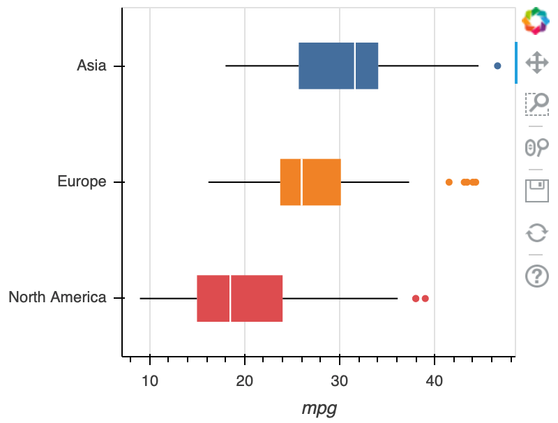


We can independently specify properties of the marks using `box_kwargs`, `whisker_kwargs`, `median_kwargs`, and `outlier_kwargs`. For example, say we wanted our colors to be [Betancourt red](https://betanalpha.github.io/assets/case_studies/principled_bayesian_workflow.html#step_four:_build_a_generative_model19), and that we wanted the outliers to also be that color and use diamond glyphs.


```python
p = bokeh_catplot.box(
    data=df,
    cats='origin',
    val='mpg',
    whisker_caps=True,
    outlier_marker='diamond',
    box_kwargs=dict(fill_color='#7C0000'),
    whisker_kwargs=dict(line_color='#7C0000', line_width=2),
)

bokeh.io.show(p)
```

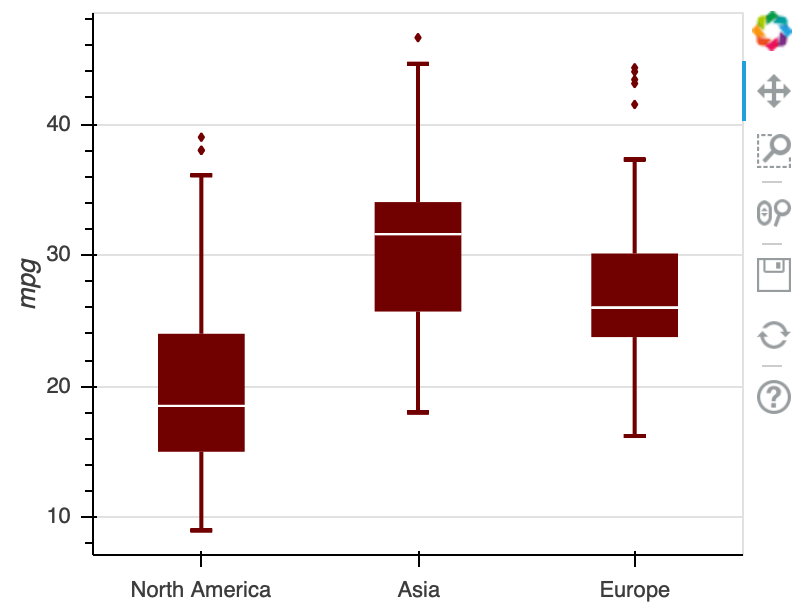


We can have multiple categories and specify a custom palette.


```python
bkp = bokeh.palettes.d3['Category20c'][20]
palette = bkp[:3] + bkp[4:7] + bkp[8:11]

p = bokeh_catplot.box(
    data=df,
    cats=['origin', 'cyl'],
    val='mpg',
    palette=palette,
    horizontal=True,
    y_axis_label='# of cylinders',
)

p.yaxis.axis_label_text_font_style = 'bold'

bokeh.io.show(p)
```

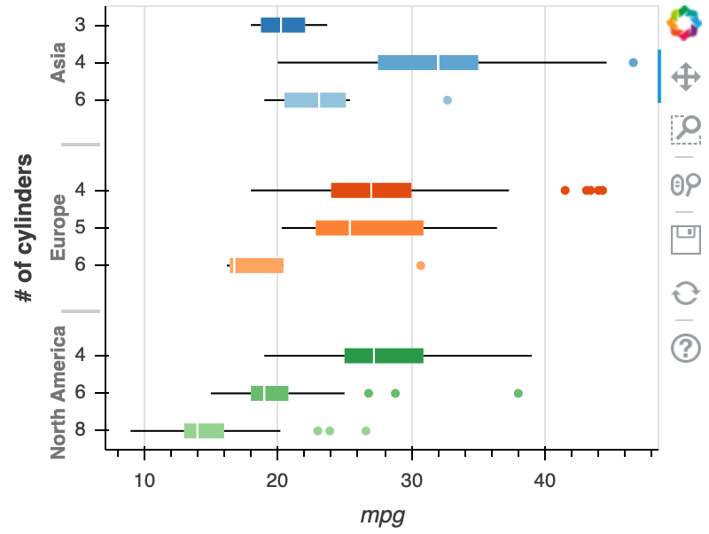


## Strip plots

We can make a strip plot with dash markers and add some transparency.


```python
p = bokeh_catplot.strip(
    data=df,
    cats='origin',
    val='mpg',
    marker='dash',
    marker_kwargs=dict(alpha=0.3)
)

bokeh.io.show(p)
```

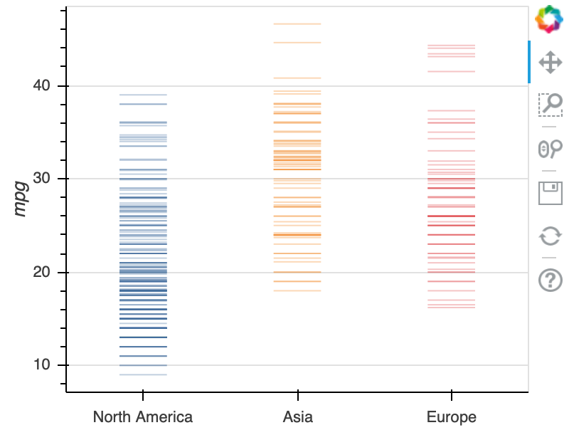


The problem with strip plots is that they can have trouble with overlapping data points. A common approach to deal with this is to "jitter," or place the glyphs with small random displacements along the categorical axis. I do that here, allowing for hover tools that give more information about the respective data points.


```python
p = bokeh_catplot.strip(
    data=df,
    cats='origin',
    val='mpg',
    jitter=True,
    marker_kwargs=dict(alpha=0.5),
    tooltips=[('year', '@yr'), ('model', '@name')]
)

bokeh.io.show(p)
```

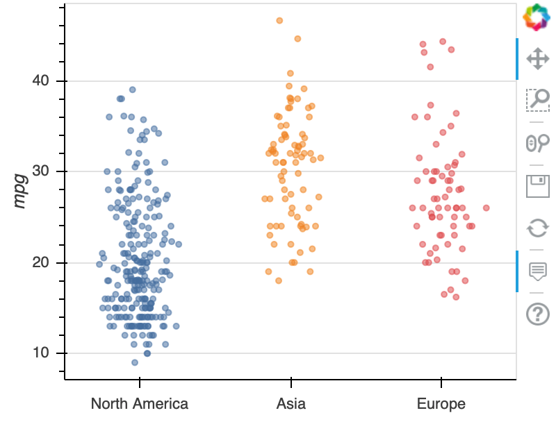


### Strip-box plots

Even while plotting all of the data, we sometimes want to graphically display summary statistics, in which case overlaying a box plot and a jitter plot is useful. To populate an existing Bokeh figure with new glyphs from another catplot, pass in the `p` kwarg. You should be careful, though, because you need to make sure the `cats`, `val`, and `horizontal` arguments exactly match.


```python
# Make a box plot
p = bokeh_catplot.box(
    data=df,
    cats='origin',
    val='mpg',
    horizontal=True,
    box_kwargs=dict(fill_color='gray', fill_alpha=0.5),
    display_points=False
)

# Overlay a jitter plot
p = bokeh_catplot.strip(
    data=df,
    cats='origin',
    val='mpg',
    p=p,
    horizontal=True,
    jitter=True,
    marker_kwargs=dict(alpha=0.5),
    tooltips=[('year', '@yr'), ('model', '@name')]
)

bokeh.io.show(p)
```

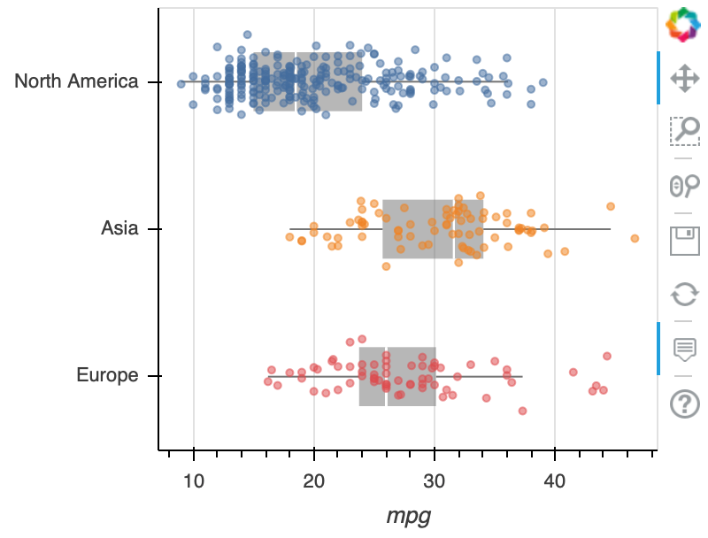


## Histograms

We could plot normalized histograms using the `density` kwarg, and we'll make the plot a little wider to support the legend.


```python
p = bokeh_catplot.histogram(
    data=df,
    cats='origin',
    val='mpg',
    density=True,
    width=550
)

bokeh.io.show(p)
```


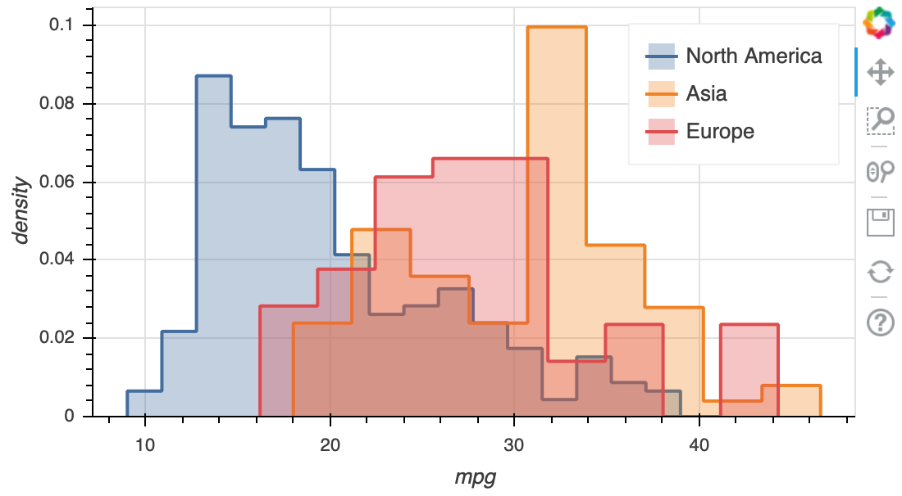


## ECDFs

An empirical cumulative distribution function, or ECDF, is a convenient way to visualize a univariate probability distribution. Consider a measurement x in a set of measurements X. The ECDF evaluated at *x* is defined as

> ECDF(x) = fraction of data points in X that are ≤ x.

By default, ECDFs are colored by category. We could wish to display formal ECDFs (staircases).


```python
p = bokeh_catplot.ecdf(
    data=df,
    cats='origin',
    val='mpg',
    formal=True,
)

bokeh.io.show(p)
```

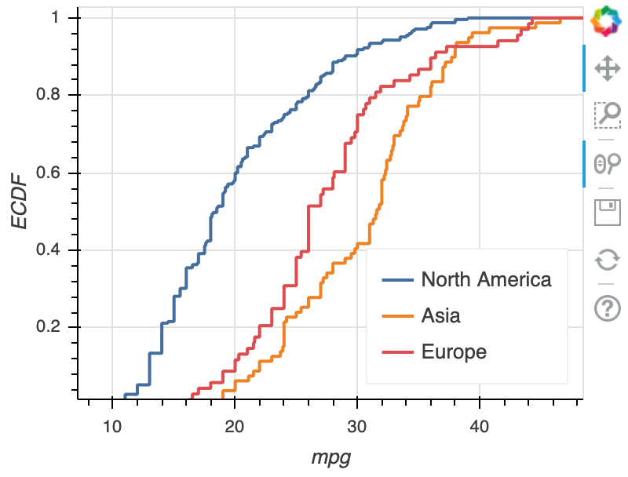

We can also display empirical complementary cumulative distribution functions (ECCDFs) using the `complementary` kwarg.

>ECCDF(x) = 1 - ECDF(x)


```python
p = bokeh_catplot.ecdf(
    data=df,
    cats='origin',
    val='mpg',
    complementary=True
)

bokeh.io.show(p)
```


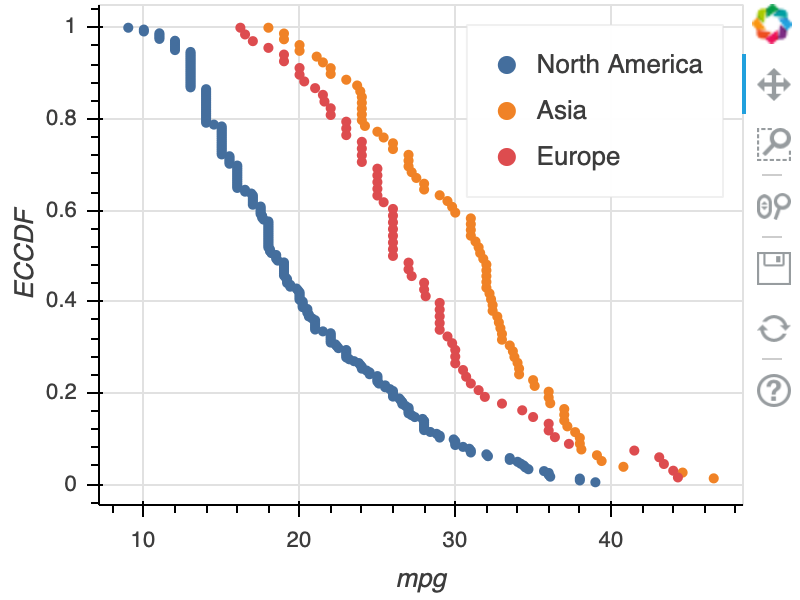


Instead of plotting a separate ECDF for each category, we can put all of the categories together on one ECDF and color the points by the categorical variable by using the `kind='colored'` kwarg.


```python
p = bokeh_catplot.ecdf(
    data=df,
    cats='origin',
    val='mpg',
    kind='colored'
)

bokeh.io.show(p)
```


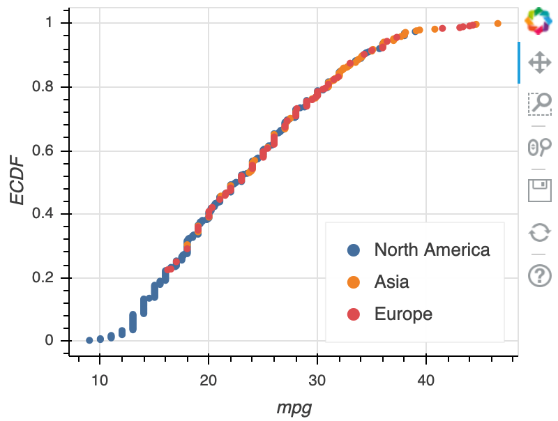


We can also display confidence intervals for the ECDFs acquired by bootstrapping using the `conf_int` kwarg.


```python
p = bokeh_catplot.ecdf(
    data=df,
    cats='origin',
    val='mpg',
    formal=True,
    conf_int=True,
)

bokeh.io.show(p)
```


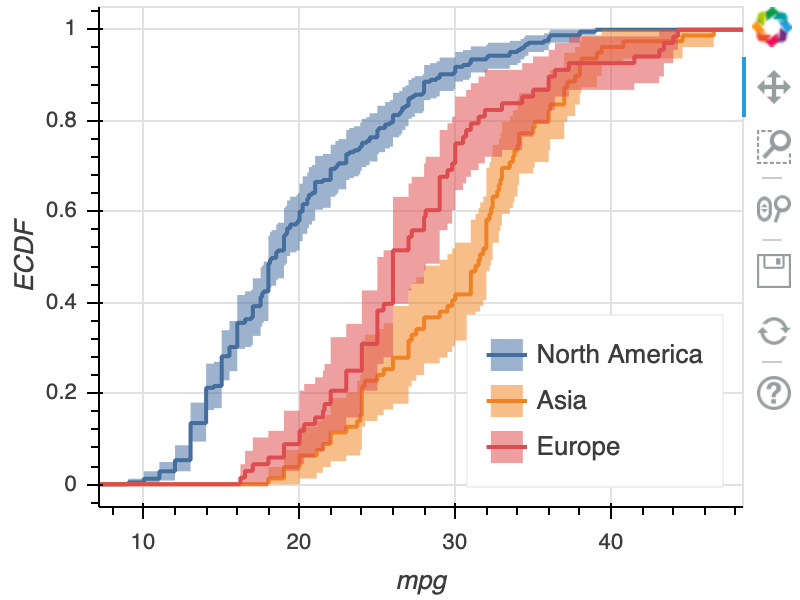


## Why no stacked bar graphs?

Stacked bar graphs are useful to displaying relative count data, but unfortunately, their utility is somewhat restricted to that. All four functions in Bokeh-catplot hand arbitrary scalar-valued quantitative data (including negative values), and including stacked bar capabilities would introduce a restriction on what kinds of data we could effectively handle.

Beyond that, there are better choices than stacked bar. To demonstrate, consider making a stacked bar plot of the counts of cars with each number of cylinders from each region of origin.


```python
count_df = df.groupby(['origin'])['cyl'].value_counts().unstack().reset_index().fillna(0)
count_df.columns = count_df.columns.astype(str)
stackers = ['3', '4', '5', '6', '8']

p = bokeh.plotting.figure(
    width=500, 
    height=300,
    x_range=['Asia', 'Europe', 'North America']
)
p.y_range.start = 0
p.vbar_stack(
    stackers=stackers, 
    width=0.5, 
    x='origin', 
    color=["#4e79a7", "#f28e2b", "#e15759", "#76b7b2", "#59a14f"], 
    source=count_df,
    legend=[bokeh.core.properties.value(s) for s in stackers]
)
p.legend.orientation = 'horizontal'
p.legend.location = 'top_left'

bokeh.io.show(p)
```


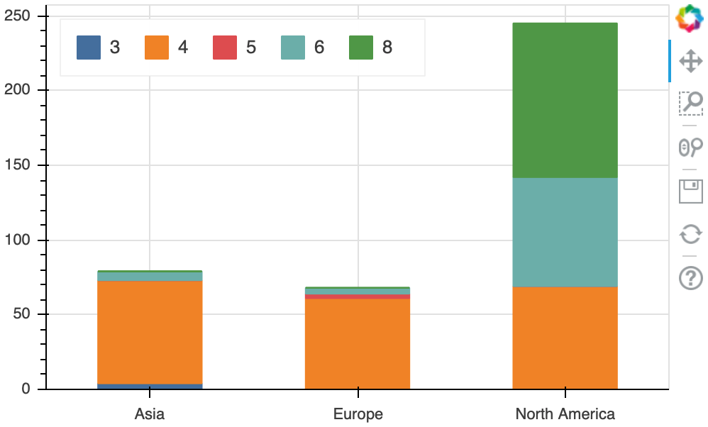


To get the actual count of each category (number of cylinders) in the stacks, you need to assess the difference from the top to bottom. Compare that with a strip plot containing the same information.


```python
p = bokeh_catplot.strip(
    data=count_df.melt(id_vars='origin', value_name='count'),
    cats='origin',
    val='count',
    color_column='cyl',
    width=500,
    show_legend=True,
    marker_kwargs=dict(size=10)
)
p.legend[0].orientation = 'horizontal'
p.legend[0].location = 'top_left'

bokeh.io.show(p)
```


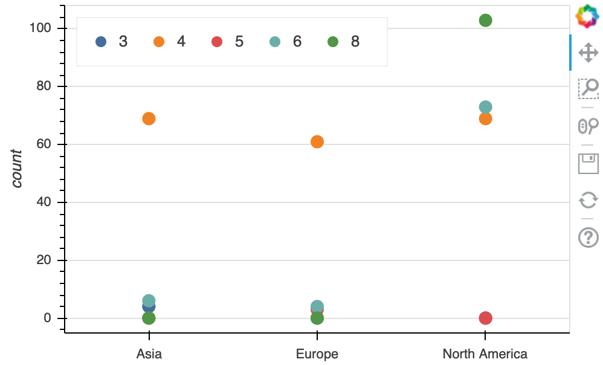


In this case, we can immediately read off the number of cars with the respective number of cylinders. Because, in my opinion, a strip plot is better than a stacked bar for almost all applications, we do not include stacked bar plots.

## Why no bar graphs?

I strongly prefer strip plots (with jitter) to box plots and ECDFs for histograms. Why? Because in the jitter plots and ECDFs, you are **plotting all of your data**. In practice, there are the only two types of visualizations for data with a categorical axis I use (though I'll sometimes overlay a jitter on a box plot to show some of the summary statistics).

A bar graph is the antithesis of plotting all of your data. You distill all of the information in the data set down to one or two summary statistics, and then use giant glyphs to show them. You should plot all of your data, so you shouldn't make bar graphs. Bokeh-catplot will help you do this.
